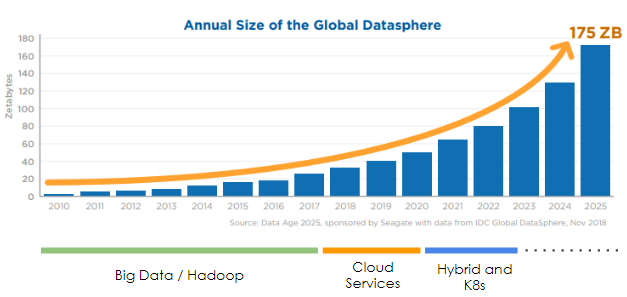

# Cloud Native Data Management 

A curated list of products, frameworks, tools and processes pertaining to Cloud Native Data Management or simply put DataOps. 

## Background
The last couple of decades have seen a humongous amount of data being generated, that have triggered many ground breaking and disruptive technologies to emerge. 

As per the [Data Landscape](https://mattturck.com/data2019/), an yearly report on the various products and companies focusing on data management as well as the IDC predictions on [global datasphere](https://www.seagate.com/in/en/our-story/data-age-2025/), we have entered a third-generation of data management. This third way of data management stack is primarily driven through the cloud native principles, with Hybrid Cloud Services and Kubernetes in the driving seat. 

The Global DataSphere which is almost growing at 40% year on year, with an estimated 175 zettabytes of data by 2025, and the applications requiring more than 30% of that data to be analyzed in real-time or near real-time, there is an need for every platform architect and SREs to adapt and build their data management stack with a goal to scale and optimize for performance and cost. This is an insurmountable task for any one person or team or company to solve. Open Source and collaborating with folks locally and globally, bring together both end-users and product development engineers is probably the only way to tackle this issue.

This repository is an attempt to bring together the various usecases, products, solutions and share the learnings with the larger community. We created a new repository as this cuts across multiple domains and projects and possibly can't be tied to any one project at this point in time. If you see similar initiatives being driven, please leave us a note via an [issue](https://github.com/oss-bootcamp/dataops/pulls) and we would love to explore how to collaborate. 

The `WE` here refers to the Platform and Kubernetes Architects and SREs that are coming together in various community driven non-profit events, organized through various meetups across the world. 

## Goals

- Connect Platform / Kubenetes / Cloud Native Architects and SREs from different backgrounds/companies via Open Source Projects and learning venues. 
- Brainstorm and generate possible data management stacks depending on the stage or needs of a company/community
- Publish Data Management Product Landscape
- Remain Community Driven and Non-profit

## Data Management Landscape (WIP)

This is still evolving. 

Our focus is to help the Platform Architects and SREs and it is inevitable that a mix of opensource and commercial tools will be used in a hybrid data centers. So each of the category in turn lists the self managed and cloud managed tools. 

- [Data Pipeline Orchestrators](./data-pipelines.md)
- [Data Warehouses](./data-warehouses.md)
- [SQL Databases](./databases-sql.md)
- [NoSQL Databases](./databases-nosql.md)
- [Object Storage](./databases-objectstorage.md)
- [Streaming](./streaming.md)

Since it is pretty hard to categorize the tools, especially when they can provide multiple aspects of data management. Always looking for feedback to make the above categorization better. Please feel free to [raise an PR](https://github.com/oss-bootcamp/dataops/pulls) with your recommended changes or [raise an issue](https://github.com/oss-bootcamp/dataops/issues/new) describing the change.

## Contributing

Feel free to modify this page or add new pages as your see appropriate. 

## Code of Conduct

[CODE OF CONDUCT](./CODE_OF_CONDUCT.md). In brief, we are committed to making participation in this project a harassment-free experience for everyone, regardless of level of experience, gender, gender identity and expression, sexual orientation, disability, personal appearance, body size, race, ethnicity, age, religion, or nationality.

